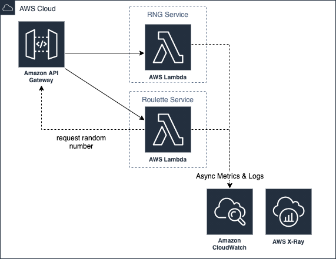

# Cloud Casino

## High Level Architecture

## Backlog

### Release process

- [x] Infrastructure as CDK (Java)
- [ ] CI/CD with CodeBuild / CodeDeploy / CodePipeline
- [ ] Deployments with versioning
- [ ] Deployments with alarms for rollback

### Observability

- [ ] Sum of stakes by game over time as a CloudWatch graph
- [ ] Sum of profit / loss by game over time as CloudWatch graph
- [ ] Latency for successful and unsuccessful invocations

### Basic functionality

- [ ] Users
- [ ] Balances
- [ ] Transactions

### API

- [ ] API Gateway config from an Open API spec yaml?
- [ ] Custom Domains
- [ ] OIDC Auth?

### Demostrate

- [ ] Scaling
- [ ] Latency
- [ ] Inject faults
- [ ] Canaries